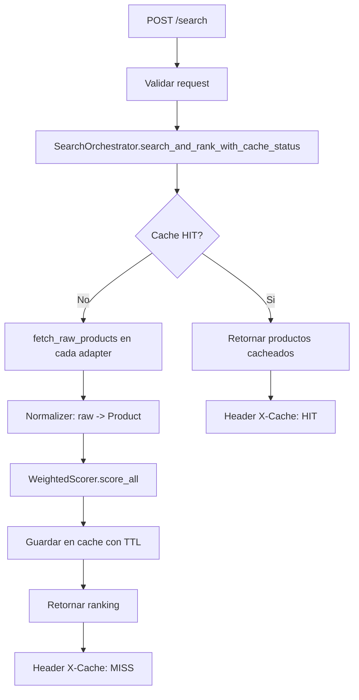

# Search Orchestrator

Un orquestador de búsqueda de productos que integra múltiples plataformas de comercio electrónico (Amazon y MercadoLibre), normaliza los resultados y los rankea según criterios personalizables.

## 🚀 Características

- **Multi-plataforma**: Busca productos simultáneamente en Amazon y MercadoLibre
- **Normalización**: Convierte datos de diferentes fuentes a un formato uniforme
- **Ranking personalizado**: Rankea productos según pesos configurables (precio, interés, disponibilidad, etc.)
- **Caché inteligente**: Almacena resultados para optimizar el rendimiento
- **API REST**: Interfaz moderna con FastAPI y Uvicorn
- **Extensible**: Fácil de añadir nuevos adaptadores para otras plataformas

## 📋 Requisitos

- Python 3.12+
- pip o poetry

## 🔧 Instalación

### 1. Clonar el repositorio

```bash
git clone <repositorio>
cd search-orchestrator
```

### 2. Crear un entorno virtual

```bash
python -m venv venv
```

### 3. Activar el entorno virtual

**Windows:**
```bash
venv\Scripts\activate
```

**Linux/macOS:**
```bash
source venv/bin/activate
```

### 4. Instalar dependencias

```bash
pip install -e .
```

Para desarrollo (incluye dependencias de pruebas):
```bash
pip install -e ".[dev]"
```

## 📚 Estructura del Proyecto

```
search-orchestrator/
├── adapters/              # Adaptadores para cada plataforma
│   ├── base.py           # Interfaz base para adaptadores
│   ├── amazon_scraper_adapter.py
│   └── mercadolibre_scraper_adapter.py
├── api/                   # Endpoints REST
│   └── routes.py         # Definición de rutas
├── cache/                 # Sistemas de caché
│   ├── abstract_cache.py # Interfaz base
│   ├── redis_cache.py    # Implementación con Redis
│   └── key_builder.py    # Generador de claves
├── normalizer/           # Normalización de datos
│   ├── engine.py         # Motor normalizador
│   ├── mapping_loader.py # Cargador de mappings
│   ├── yaml_mapping_loader.py  # Loader YAML
│   └── mappings/         # Configuración YAML por adaptador
├── ranker/              # Sistema de ranking
│   ├── strategy.py      # Interfaz de ranking
│   └── weighted_scorer.py  # Implementación con pesos
├── domain/              # Modelos de dominio
│   └── product.py       # Clase Product
├── tests/               # Suite de pruebas
├── main.py              # Punto de entrada
├── orchestrator.py      # Orquestador principal
└── pyproject.toml       # Configuración del proyecto
```

## 🚀 Uso

### Iniciar la API

```bash
python main.py
```

O manualmente:
```bash
uvicorn api.routes:app --reload
```

La API estará disponible en `http://localhost:8000`

### Endpoints

#### 1. Health Check
```bash
GET /health
```

Respuesta:
```json
{
  "status": "ok"
}
```

#### 2. Buscar productos
```bash
POST /search
```

**Body (ejemplo):**
```json
{
  "query": "laptop",
  "weights": {
    "price": 0.6,
    "months_without_interest": 0.2,
    "in_stock": 0.2,
    "delivery_days": 0.0
  }
}
```

**Respuesta (ejemplo):**
```json
[
  {
    "cash_price": 25000.0,
    "title": "Laptop XYZ",
    "installment_price": null,
    "months_without_interest": false,
    "msi_months": null,
    "in_stock": true,
    "delivery_days": 3,
    "url": "https://..."
  }
]
```

**Headers de respuesta:**
- `X-Cache`: "HIT" (desde caché) o "MISS" (búsqueda nueva)

## 🏗️ Arquitectura

### Arquitectura Hexagonal (Ports and Adapters)

El proyecto implementa una arquitectura hexagonal: el caso de uso central vive en el orquestador y se conecta a puertos (interfaces) con adaptadores intercambiables.

### Vista por capas

- **Entrada (API)**: recibe la request HTTP, valida y transforma payloads.
- **Núcleo de aplicación (Orquestación)**: coordina caché, extracción, normalización y ranking.
- **Integración (Adapters)**: obtiene datos crudos de cada marketplace.
- **Dominio**: modelo unificado de producto (`Product`).
- **Infraestructura transversal**: caché y mappings YAML.

```text
api/routes.py
   -> orchestrator.py (SearchOrchestrator)
    -> cache/*
    -> adapters/*
    -> normalizer/*
    -> ranker/*
    -> domain/product/product.py
```

### Flujo de una búsqueda



### Contratos e implementaciones

- **Contrato de adapters**: `StoreAdapter` define `source_name` y `fetch_raw_products(query)`.
- **Contrato de caché**: `AbstractCache` define `get` y `set`.
- **Estrategia de ranking**: `RankStrategy` permite intercambiar algoritmos.
- **Normalización configurable**: `YamlMappingLoader` carga mappings por fuente para evitar hardcode.

### Mapeo Hexagonal (Puertos y Adaptadores)

- **Puerto de entrada**: API FastAPI en `api/routes.py` (recibe `POST /search`).
- **Caso de uso central**: `SearchOrchestrator` en `orchestrator.py`.
- **Puertos de salida**: contratos `StoreAdapter`, `AbstractCache`, `RankStrategy`.
- **Adaptadores de salida**: `AmazonScraperAdapter`, `MercadoLibreScraperAdapter`, `InMemoryCache`, `RedisCache`, `WeightedScorer`, `YamlMappingLoader`.

### Componentes principales

- **SearchOrchestrator**: punto único de coordinación del caso de uso de búsqueda.
- **Adapters** (`AmazonScraperAdapter`, `MercadoLibreScraperAdapter`): traducen HTML/API externa a `RawProduct`.
- **Normalizer**: aplica mappings y genera `Product` consistente.
- **WeightedScorer**: calcula score por criterios y ordena resultados.
- **Cache** (`InMemoryCache`, `RedisCache`): evita scraping repetido y reduce latencia.

### Decisiones de diseño

- **Separación fuerte de responsabilidades** para facilitar pruebas unitarias por módulo.
- **Extensión por contrato**: nuevos marketplaces se agregan implementando `StoreAdapter`.
- **Config-driven normalization**: cambios de estructura de fuentes se atienden en YAML sin tocar lógica de dominio.
- **Estrategia de ranking pluggable** para experimentar con distintos modelos de score.

## 🧪 Pruebas

Ejecutar todas las pruebas:
```bash
pytest
```

Con cobertura:
```bash
pytest --cov=. --cov-report=html
```

Estructura de pruebas:
```
tests/
├── test_orchestrator.py
├── adapters/
│   ├── test_amazon_scraper_adapter.py
│   └── test_mercadolibre_scraper_adapter.py
├── cache/
│   └── test_redis_cache.py
├── normalizer/
│   ├── test_normalizer.py
│   └── test_yaml_mapping_loader.py
└── ranker/
    └── test_weighted_scorer.py
```

## ⚙️ Configuración

### Weights de Ranking
En `api/routes.py`, los pesos por defecto son:
```python
{
    "price": 0.6,                    # 60% - Precio
    "months_without_interest": 0.2,  # 20% - Meses sin interés
    "in_stock": 0.2,                 # 20% - Disponibilidad
    "delivery_days": 0.0             # 0% - Días de entrega
}
```

Pueden modificarse por request en el endpoint `/search`.

### Mappings de Normalización
Configuración en `normalizer/mappings/`:
- `amazonscraperadapter.yaml`: Transformación de datos de Amazon
- `mercadolibrescraperadapter.yaml`: Transformación de datos de MercadoLibre

### TTL de Caché
Por defecto es de 300 segundos (5 minutos). Modificar en `orchestrator.py`:
```python
DEFAULT_CACHE_TTL = 300
```

## 🔌 Extensibilidad

### Agregar un nuevo adaptador

1. Crear clase en `adapters/new_platform_adapter.py`:
```python
from adapters.base import StoreAdapter
from domain.product import Product

class NewPlatformAdapter(StoreAdapter):
    def search(self, query: str) -> list[Product]:
        # Implementar búsqueda
        pass
```

2. Registrar en `main.py`:
```python
orchestrator = SearchOrchestrator(
    adapters=[
        AmazonScraperAdapter(...),
        MercadoLibreScraperAdapter(...),
        NewPlatformAdapter(...),  # Agregar aquí
    ],
    ...
)
```

### Agregar un nuevo sistema de caché

1. Implementar `AbstractCache`:
```python
from cache.abstract_cache import AbstractCache

class CustomCache(AbstractCache):
    def get(self, key: str) -> list[Product] | None:
        # Implementar
        pass
    
    def set(self, key: str, value: list[Product], ttl_seconds: int) -> None:
        # Implementar
        pass
```

2. Usar en `main.py`:
```python
cache = CustomCache()
orchestrator = SearchOrchestrator(..., cache=cache)
```

## 📝 Pesos de Búsqueda

Los pesos determinan cómo se rankean los productos:

| Criterio | Descripción | Rango |
|----------|-------------|--------|
| `price` | Peso del precio (menor es mejor) | 0.0 - 1.0 |
| `months_without_interest` | Peso meses sin interés (mayor es mejor) | 0.0 - 1.0 |
| `in_stock` | Peso disponibilidad (true es mejor) | 0.0 - 1.0 |
| `delivery_days` | Peso días de entrega (menor es mejor) | 0.0 - 1.0 |

**Ejemplo - Enfoque en precio:**
```json
{
  "price": 0.8,
  "months_without_interest": 0.1,
  "in_stock": 0.1,
  "delivery_days": 0.0
}
```

**Ejemplo - Enfoque en disponibilidad:**
```json
{
  "price": 0.3,
  "months_without_interest": 0.2,
  "in_stock": 0.5,
  "delivery_days": 0.0
}
```

## 🐛 Troubleshooting

### "Query cannot be empty"
La búsqueda rechaza queries vacías o solo con espacios. Proporciona un query válido.

### Caché no funciona
Asegúrate de que el ttl_seconds sea mayor a 0 y que el motor de caché esté correctamente inicializado.

### Resultados inconsistentes entre ejecuciones
Puede deberse a cambios en las plataformas. Verifica los mappings YAML en `normalizer/mappings/`.

## 📦 Dependencias principales

- **httpx**: Cliente HTTP asincrónico
- **beautifulsoup4**: Parsing HTML
- **pyyaml**: Procesamiento de archivos YAML
- **redis**: Caché distribuida (opcional)
- **fastapi**: Framework web
- **uvicorn**: Servidor ASGI

## 📄 Licencia

Especificar licencia del proyecto aquí.

## 👥 Contribuciones

Las contribuciones son bienvenidas. Por favor:

1. Fork el proyecto
2. Crea una rama para tu feature (`git checkout -b feature/AmazingFeature`)
3. Commit tus cambios (`git commit -m 'Add some AmazingFeature'`)
4. Push a la rama (`git push origin feature/AmazingFeature`)
5. Abre un Pull Request

## 📞 Contacto

Para preguntas o sugerencias, abre un issue en el repositorio.
